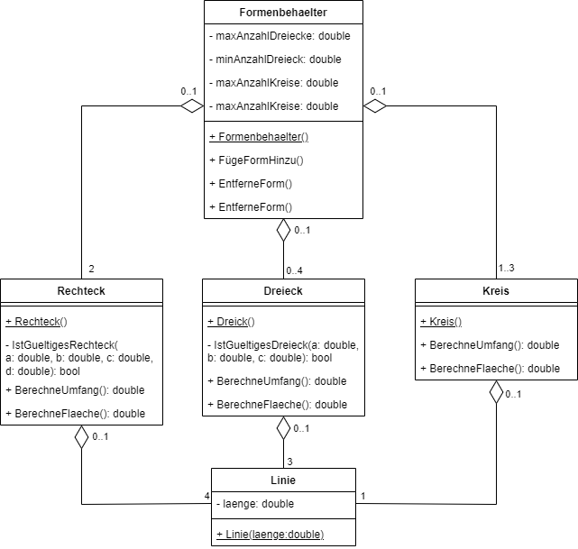

# Portfolio-Aufgabe_GeoShapes

## Auftrag
Im Rahmen dieses Auftrages werden Sie geometrische Figuren in einer Software abbilden. Dies werden Sie in drei Schritten erledigen: Analyse,  Design, Implementation.

## Spezifikation
Die Firma «GeoShapes» gibt Ihnen folgende Spezifikation für die zu entwickelnde Software vor:
- Ein Rechteck hat genau vier Linien
- Ein Dreieck hat genau drei Linien
- Ein Kreis hat genau eine Linie
- Linien können auch ohne ihr Ganzes existieren
- Rechtecke, Kreise und Dreiecke können ihren Umfang berechnen
- Rechtecke, Kreise und Dreiecke können ihre Fläche berechnen
- Der Formenbehälter kann null bis vier Dreiecke besitzen
- Der Formenbehälter kann einen bis drei Kreise besitzen
- Der Formenbehälter muss genau zwei Rechtecke besitzen

## Analyse
Analysieren Sie oben beschriebene Spezifikation.
1.	Identifizieren Sie alle Akteure
2.	Identifizieren Sie alle Fähigkeiten der Akteure

- Linien
- Rechteck:
  Umfang berechnen, Fläche berechnen
- Dreieck:
  Umfang berechnen, Fläche berechnen
- Kreis:
  Umfang berechnen, Fläche berechnen
- Formenbehälter

## Design
Erstellen Sie mit Hilfe Ihrer Analyse ein Klassendiagramm nach UML. 

